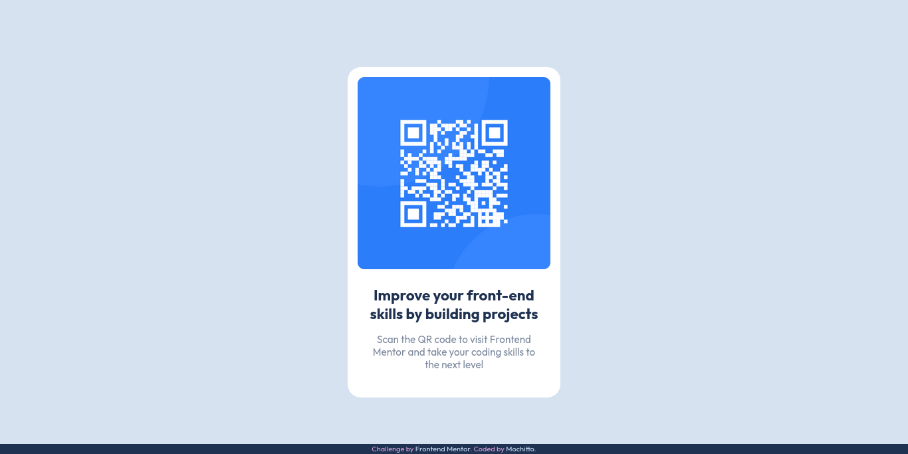

## Table of contents

- [Overview](#overview)
  - [Screenshot](#screenshot)
  - [Links](#links)
- [My process](#my-process)
  - [Built with](#built-with)
  - [What I learned](#what-i-learned)
  - [Continued development](#continued-development)
- [Author](#author)
- [Challenge source](#challenge-source)

## Overview

### Screenshot

| Given Desktop | Given Mobile |
| :--------: | :--------:  |
| |  |

------

| Desktop | Mobile |
| :--------: | :--------:  |
| |  |

### Links

- Solution URL: [You can find it here!](https://www.frontendmentor.io/solutions/qr-card-component-made-with-flexbox-sass-and-smacss-VfBFgx6Rl4)
- Live Site URL: [You can find it here!](https://mochitto.github.io/Qr-code-component/)

## My process

As the component is static, I went with a desktop-first approach.
I had some difficulties yet again with trying to make it responsive, later noticing it wasn't necessary.
For accessibility and due to wondering if the user might want to go directly to the website, I've added an anchor on hover or focus to the QR-code.

| Card when hovering the QR-Code |
| :--------: |
| |

### Built with

- Semantic HTML5 markup
- Desktop-first workflow
- CSS custom properties
- Flexbox
- SCSS/Sass
- SMACSS Methodology

### What I learned

I learned how to have elements change upon hover, even if they are children of the hovered element and got a taste of transitions.

### Continued development

I definitely want to understand better:
- transitions 
- states 
- responsiveness

## Author

- Frontend Mentor - [@mochitto](https://www.frontendmentor.io/profile/Mochitto)
- Twitter - [@mochideveloper](https://twitter.com/mochideveloper)

# Challenge source

This is a solution to the [QR code component challenge on Frontend Mentor](https://www.frontendmentor.io/challenges/qr-code-component-iux_sIO_H). 
Frontend Mentor challenges help you improve your coding skills by building realistic projects. 
